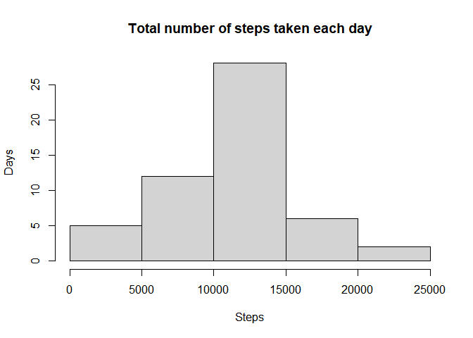
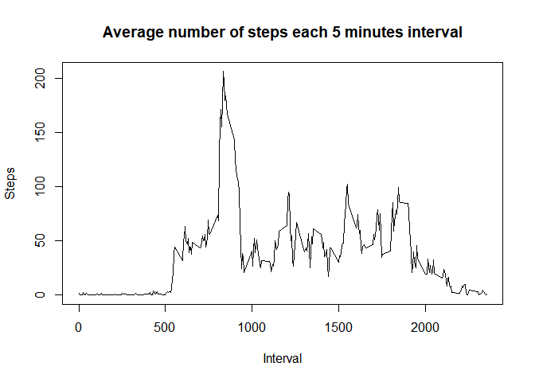
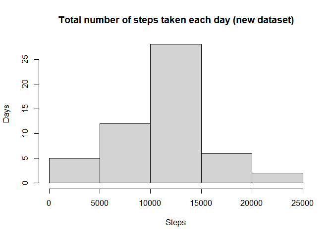
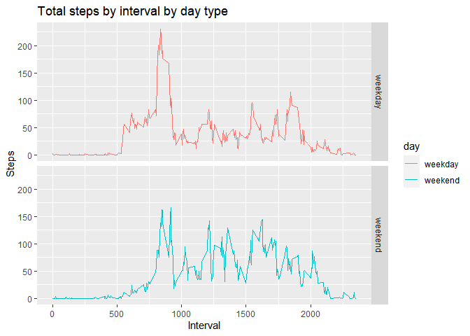

## Loading and preprocessing the data

```
## 
## Attaching package: 'dplyr'
```

```
## The following objects are masked from 'package:stats':
## 
##     filter, lag
```

```
## The following objects are masked from 'package:base':
## 
##     intersect, setdiff, setequal, union
```

```r
data <- read.csv(unz("activity.zip","activity.csv"),header=TRUE)
data$date <- as.Date(data$date)
complete_cases <- data[complete.cases(data),]
```

## What is mean total number of steps taken per day?
1. Calculate the total number of steps taken per day

```r
steps_by_day <- aggregate(steps ~ date,complete_cases,sum)
```

2. Make a histogram of the total of steps taken each day

```r
hist(steps_by_day$steps, main="Total number of steps taken each day",xlab="Steps", ylab="Days")
```

<!-- -->
3. Calculate and report the mean and median of the total number of steps taken per day


```r
summarized_data <- steps_by_day %>%
summarize(Mean=mean(steps),Median=median(steps[steps>0],na.rm=TRUE)) %>%
print
```

```
##       Mean Median
## 1 10766.19  10765
```

## What is the average daily activity pattern?
1. Make a time series plot of the 5-minute interval and the average number of steps taken

```r
mean_5_minutes_interval <- aggregate(steps ~ interval,complete_cases,mean)
with(mean_5_minutes_interval,plot(mean_5_minutes_interval$interval,steps,type="l",main="Average number of steps each 5 minutes interval",xlab="Interval",ylab="Steps"))
```

<!-- -->

2. Which 5-minute interval, on average across all the days in the dataset, contains the maximum number of steps?


```r
mean_5_minutes_interval[which.max(mean_5_minutes_interval$steps),]
```

```
##     interval    steps
## 104      835 206.1698
```

## Imputing missing values

1. Calculate and report the total number of missing values in the dataset


```r
sum(!complete.cases(data))
```

```
## [1] 2304
```

2. Filling the missing values of the dataset with the mean for the interval and 

3. Create a new dataset that is equal to the original dataset but with the missing data filled in.


```r
complete_data <- data
for(r in 1:nrow(complete_data)){
  if(is.na(complete_data$steps[r])){
    m <- mean_5_minutes_interval[mean_5_minutes_interval$interval==complete_data$interval[r],"steps"]
    complete_data$steps[r]<- as.integer(round(m))
  }
}
```

4. Make a histogram of the total number of steps taken each day and Calculate and report the mean and median total number of steps taken per day.Do these values differ from the estimates from the first part of the assignment?


```r
complete_steps_by_day <- aggregate(steps ~ date,complete_data,sum)
hist(steps_by_day$steps, main="Total number of steps taken each day (new dataset)",xlab="Steps", ylab="Days")
```

<!-- -->

What is the impact of imputing missing data on the estimates of the total daily number of steps?


```r
complete_summarized_data <- complete_steps_by_day %>%
summarize(Mean=mean(steps),Median=median(steps[steps>0],na.rm=TRUE)) %>%
print
```

```
##       Mean Median
## 1 10765.64  10762
```

## Are there differences in activity patterns between weekdays and weekends?
1. Create a new factor variable in the dataset with two levels – “weekday” and “weekend” indicating whether a given date is a weekday or weekend da


```r
complete_data <- complete_data %>%
mutate(day = ifelse(weekdays(date)=="Sunday" | weekdays(date) == "Saturday","weekend","weekday"))

complete_data$day <- as.factor(complete_data$day)
```

2. Make a panel plot containing a time series plot (i.e. \color{red}{\verb|type = "l"|}type = "l") of the 5-minute interval (x-axis) and the average number of steps taken, averaged across all weekday days or weekend days (y-axis). See the README file in the GitHub repository to see an example of what this plot should look like using simulated data.


```r
mean_5_minutes_interval_day <- complete_data %>%
  group_by(interval,day) %>%
  summarize(Mean=mean(steps))
```

```
## `summarise()` has grouped output by 'interval'. You can override using the `.groups` argument.
```

```r
p <- ggplot(data=mean_5_minutes_interval_day,aes(x=interval,y=Mean,color=day)) + 
  facet_grid(rows=mean_5_minutes_interval_day$day) +
  ylab("Steps") +
  xlab("Interval") +
  
labs(title = "Total steps by interval by day type")+
geom_line() 
print(p)
```

<!-- -->

